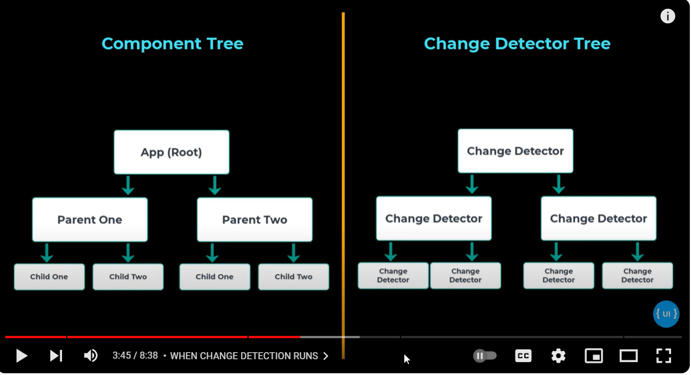
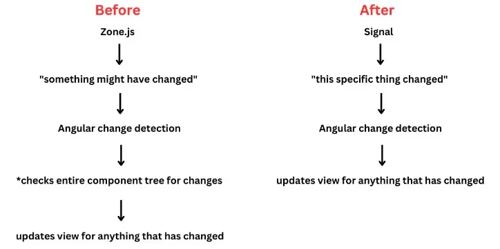

**ChangeDetection**

It is the ability to detect change.Change detection in angular makes sure that view and component are always in sync.

Zone.js:
This is responsible for scheduling change detection.It is scheduled whenever
 1)events like mouseover ,click,submit
 2)API request
 3)Async funtion like setInterval,setTimeout executes in angular app

 
**signal**
A signal is a wrapper around a value that notifies interested cons
umers when that value changes. Signals can contain any value, from primitives to complex data structures.

Reference
https://medium.com/@chandrashekharsingh25/angular-signals-explained-with-practical-examples-e45de6d00925
https://www.youtube.com/watch?v=ZL_goJVUmz0

